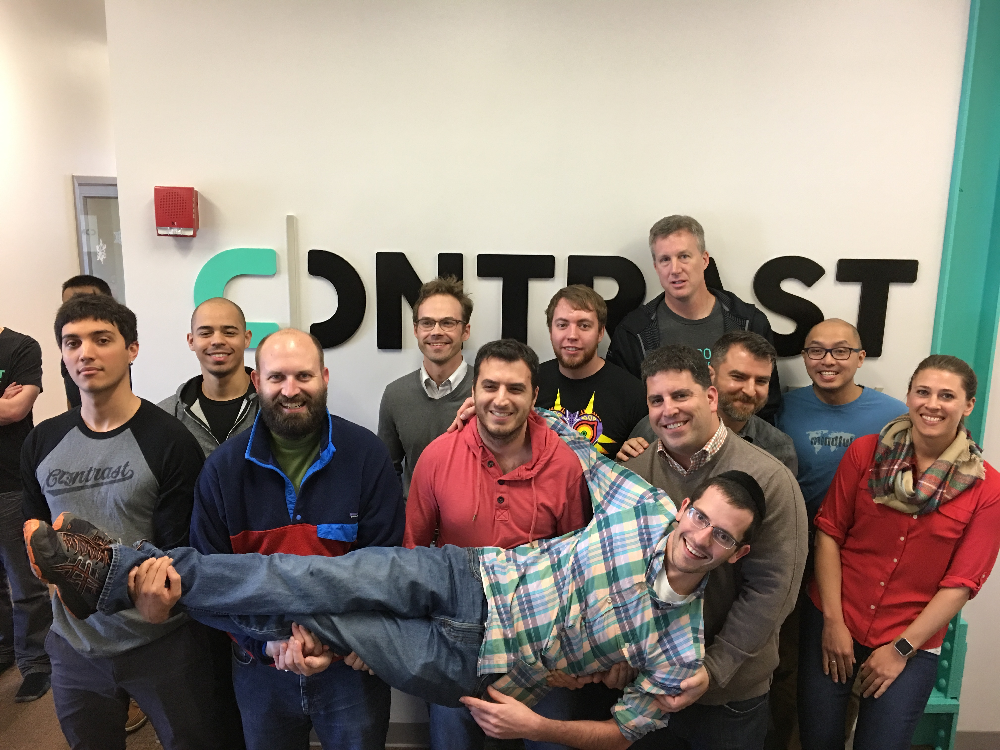
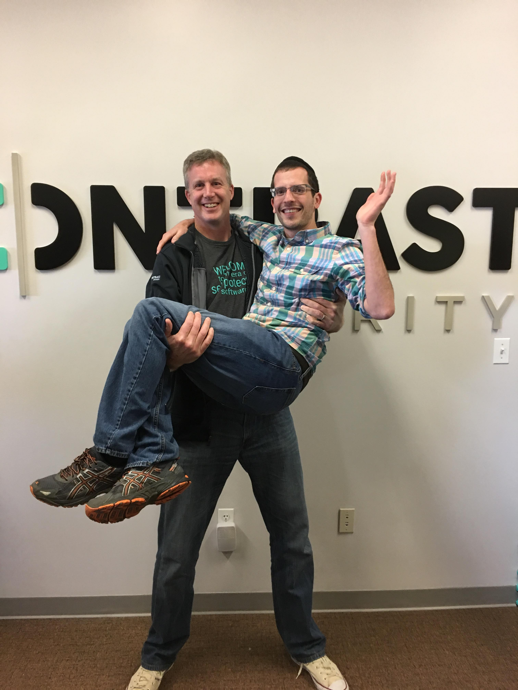

# Contrast Operations Hire Project

# Introduction

At Contrast we like to play hard, work hard, and automate our Saas environment end to end. We made this project so you can showcase your skills and give us a better idea of your individual talents!

# Setup

Before we start, install these packages on your computer

* ansible
* vagrant
* virtualbox

# Stack

Inside the root folder of this project, there is Vagrant file along with ansible code that will build out an appserver and a MySQL database. After the provisioning finishes, you will have a web application running locally at http://192.168.50.4. Login credentials are admin/admin. 

# The goal

Make this project better by adding new features and improving our automation.

# Tasks

* Reconfigure our appserver to use Nginx rather than Apache as a reverse proxy. You probably need fastcgi. 
* Change the listening port of MySQL and update the rest of the automation so the web application works properly. 
* Add firewall restrictions to make the stack more secure. Feel free to use Iptables, Shorewall, or any similar utilities. 
* Generate self-signed SSL cert for nginx.
* Install and configure fail2ban to lock out users after too many failed SSH logins.
* Add an LDAP server to our application stack. 
* Setup a monitoring agent to monitor the system status of the servers. 

